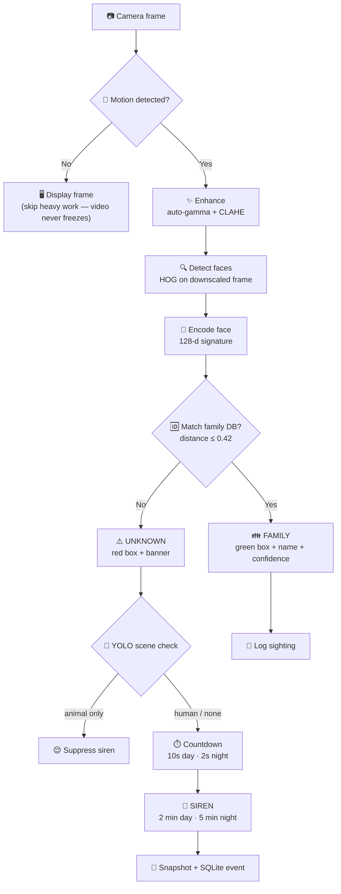
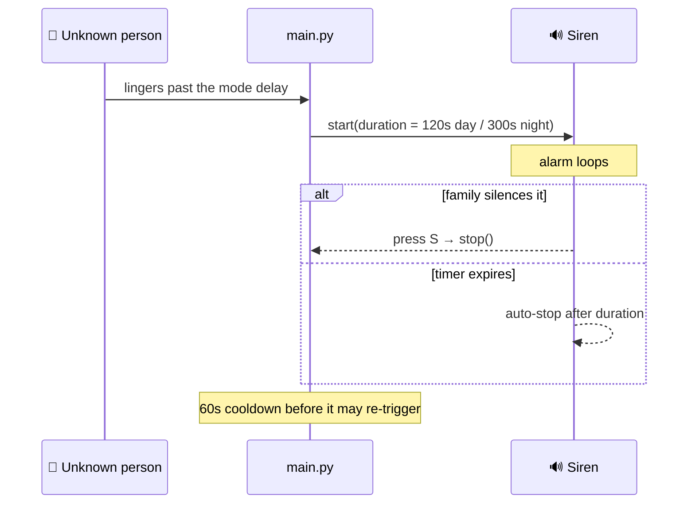
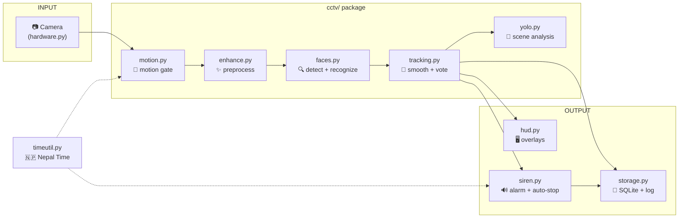

# 📷 Smart CCTV — Face Recognition Security System

<p align="center">
  
  
  
  
  
</p>

<p align="center">
  <b>Real-time facial recognition surveillance using nothing more than a webcam.</b><br>
  Identify family members 👪 · Detect intruders 🚨 · Trigger alarms 🔊 · All in Nepal Time 🇳🇵
</p>

---

## ✨ Highlights

|                             |                                                                                                                                      |
| --------------------------- | ------------------------------------------------------------------------------------------------------------------------------------ |
| 👪 **Knows your family**    | Guided registration learns faces; names appear in green with confidence %                                                            |
| ➕ **One-click enrollment** | Click the `+ ADD FAMILY` button in the live view — type a name, then just look at the camera while photos are captured automatically |
| 🚨 **Catches strangers**    | Red `UNKNOWN PERSON DETECTED` banner, countdown, snapshots, loud siren                                                               |
| 🇳🇵 **Nepal Time aware**     | Day mode (2-min siren) and Night Security mode from 10 PM (5-min siren)                                                              |
| 🐾 **No false alarms**      | YOLOv8 suppresses the siren when only animals are in view                                                                            |
| ⚡ **Runs anywhere**        | Three performance profiles: from 2-core/4 GB boxes up to GPU machines                                                                |
| 🔌 **Future-ready**         | Hardware abstraction for Raspberry Pi 5 and ESP32-CAM                                                                                |
| 🎞️ **Smooth video**         | Motion gate + 1-frame camera queue — never freezes, never lags                                                                       |

---

## 📖 Table of Contents

- [Overview](#-overview)
- [How It Works](#-how-it-works)
- [Features](#-features)
- [Security Modes & Siren](#-security-modes--siren-nepal-time)
- [Requirements](#-requirements)
- [Quick Start](#-quick-start)
- [Family Registration](#-family-registration)
- [Running the System](#-running-the-system)
- [Animal Detection](#-animal-detection)
- [Performance Profiles](#-performance-profiles)
- [Hardware Compatibility](#-hardware-compatibility)
- [System Architecture](#-system-architecture)
- [Project Structure](#-project-structure)
- [Configuration Reference](#-configuration-reference)
- [Database Schema](#-database-schema)
- [Keyboard Controls](#-keyboard-controls)
- [Troubleshooting](#-troubleshooting)
- [License](#-license)

---

## 🔍 Overview

Smart CCTV turns a webcam into an intelligent security system. It:

- **Learns** family members' faces through a guided registration process
- **Monitors** the camera feed in real time
- **Recognizes** registered individuals and logs their presence
- **Detects** unknown people, saves snapshots, and sounds an audible siren
- **Suppresses false alarms** caused by animals using YOLOv8 object detection
- **Switches to Night Security mode automatically at 10 PM** Nepal Time

All events are logged to a SQLite database (`logs/events.db`) and a text log file (`logs/security.log`) for review.

> 📘 **New to the codebase?** Read [ARCHITECTURE.md](ARCHITECTURE.md) for a narrative walkthrough of every module, the life of a frame, and where to look when something goes wrong.

---

## 🔄 How It Works

Every camera frame walks through the pipeline, **cheapest checks first**, so a quiet scene costs almost nothing:



---

## 🧩 Features

### Face Detection

| Feature                  | Description                                                             |
| ------------------------ | ----------------------------------------------------------------------- |
| HOG detection            | Fast real-time face detection on scaled frames                          |
| CNN fallback             | Deep-learning detection when HOG finds nothing (balanced/high profiles) |
| Min face size filter     | Rejects tiny false-positive detections                                  |
| Dual-resolution scanning | Detection at reduced scale with optional full-res CNN                   |

### Image Preprocessing

| Technique                  | Benefit                                                                   |
| -------------------------- | ------------------------------------------------------------------------- |
| Auto gamma correction      | Brightens dark frames, dims overexposed ones                              |
| CLAHE contrast enhancement | Improves face visibility in shadows and glare                             |
| Bilateral denoising        | Reduces noise while preserving edges (skipped on `low` profile for speed) |

### Temporal Tracking

| Technique               | Benefit                                               |
| ----------------------- | ----------------------------------------------------- |
| Majority-vote ensemble  | Identity decided over a window of frames, not one     |
| Centroid track matching | Stable identity across detection gaps                 |
| EMA box smoothing       | Steady bounding boxes, less jitter                    |
| Frame-skip detection    | Full detection every N frames; tracks persist between |

### Motion Gate

| Technique                     | Benefit                                                  |
| ----------------------------- | -------------------------------------------------------- |
| Background-model differencing | Catches slow, gradual intrusion a naive diff misses      |
| Idle skip                     | Heavy pipeline runs only when something moves            |
| Always-on display             | Frames still render while idle — the video never freezes |

### Registration (`register.py`)

- **Auto-capture** — saves photos automatically once the subject holds still
- **Blur detection** — rejects blurry photos (Laplacian variance threshold)
- **Brightness check** — rejects too-dark or too-light captures
- **Duplicate rejection** — skips photos too similar to already-captured poses
- **Quality overlay** — green box for good frames, red for rejected, plus a progress bar

### Alarm Behavior

- Looping WAV siren when an unknown person lingers past the delay
- **Auto-shutdown** after 2 min (day) or 5 min (night) — never runs forever
- Manual silence anytime with `S`
- **Re-trigger cooldown** (60 s) after each stop prevents alarm loops
- Snapshots of unknown individuals saved at configurable intervals
- Animal-only scenes suppress the siren entirely

### Event Logging

- **SQLite database** (`logs/events.db`) — structured, queryable history
- **Text log** (`logs/security.log`) — human-readable audit trail
- Rate-limited family sighting entries to keep the database lean

#### Event Types

| Event               | Description                                     |
| ------------------- | ----------------------------------------------- |
| `SIREN_TRIGGERED`   | Siren fired (records mode + auto-stop duration) |
| `SIREN_ON`          | Siren alarm activated                           |
| `SIREN_OFF`         | Siren silenced manually (`S` key)               |
| `SIREN_AUTO_OFF`    | Siren auto-stopped when its duration expired    |
| `UNKNOWN_CONFIRMED` | Unknown person detected and confirmed           |
| `UNKNOWN_SNAPSHOT`  | Snapshot saved of unknown person                |
| `FAMILY_SIGHTING`   | Recognized family member spotted                |

---

## 🚨 Security Modes & Siren (Nepal Time)

All time-of-day logic uses **Nepal Time** (NPT, UTC+5:45) via `cctv/timeutil.py`, so the system behaves correctly no matter what timezone the host machine is set to.

| Mode                  | 🕐 Nepal time | ⏱️ Confirm delay                    | 🔊 Siren duration                  |
| --------------------- | ------------- | ----------------------------------- | ---------------------------------- |
| ☀️ **Day**            | 06:00–22:00   | 10 s (`UNKNOWN_DELAY_SECONDS`)      | **2 min** (`SIREN_DAY_DURATION`)   |
| 🌙 **Night security** | 22:00–06:00   | 2 s (`NIGHT_UNKNOWN_DELAY_SECONDS`) | **5 min** (`SIREN_NIGHT_DURATION`) |

- 🌙 **Night security mode arms automatically at 10 PM** Nepal time; the display switches to **NIGHT SECURITY MODE** (amber) with a faster response and longer siren.
- ⏳ **The siren never runs forever.** It auto-stops after the mode's duration. A family member can silence it early by pressing **`S`**.
- 🔁 After an auto-stop, a `SIREN_RETRIGGER_COOLDOWN` (60 s) prevents an immediate re-trigger loop, giving the family time to respond.
- 🐾 Animals still suppress the alarm (YOLO), and a confirmed human shortens the delay to `UNKNOWN_HUMAN_DELAY_SECONDS`.



---

## 📦 Requirements

| Dependency                                             | Purpose                                                                   |
| ------------------------------------------------------ | ------------------------------------------------------------------------- |
| Python 3.12+                                           | Runtime                                                                   |
| Webcam (USB, built-in, Pi camera, or ESP32-CAM stream) | Video input                                                               |
| `opencv-python`                                        | Camera capture, image processing                                          |
| `face_recognition`                                     | Face detection and recognition                                            |
| `pygame`                                               | Siren audio playback                                                      |
| `numpy`                                                | Numerical operations                                                      |
| `setuptools<81` (Python 3.12+)                         | Provides `pkg_resources` for `face_recognition_models`                    |
| `ultralytics` _(optional)_                             | YOLOv8 animal/human detection — only if `ANIMAL_DETECTION_ENABLED = True` |

---

## 🚀 Quick Start

```bash
# 1. Create and activate a virtual environment
python3 -m venv .venv
source .venv/bin/activate

# 2. Install dependencies
pip install -r requirements.txt

# 3. (Optional) YOLO animal suppression - only if ANIMAL_DETECTION_ENABLED = True
pip install ultralytics
wget https://github.com/ultralytics/assets/releases/download/v8.3.0/yolov8n.pt

# 4. Register a family member
python register.py

# 5. Run the system
python main.py
```

> **Python 3.12+ note:** `face_recognition_models` depends on the deprecated
> `pkg_resources` module. Pinning `setuptools<81` restores it. A harmless
> deprecation warning may appear on import.

---

## 👪 Family Registration

There are **two ways** to add a family member — both use the same quality
gates and save photos to `family/<name>/`.

### Option 1 — In-app (easiest) ➕

While the system is running, click the green **`+ ADD FAMILY`** button in
the bottom-right corner of the live view (or press **`a`**):

1. **Type the name** on the keyboard → `Enter` to confirm, `Esc` to cancel
2. **Just look at the camera** — photos are captured automatically every
   ~1.2 seconds while your face is sharp and well lit. Slowly turn your
   face left and right: a duplicate-pose check rejects photos too similar
   to ones already kept, so the saved set naturally covers varied angles.
   A green progress bar under your face counts down to the next photo.
3. After 10 photos (or `Q`/`Esc` to finish early), monitoring resumes and
   the new person is recognized **immediately** — no restart needed.

The alarm is paused during enrollment, so registration is calm and safe.

### Option 2 — Command line

```bash
python register.py
```

1. **Enter name** — type the person's name when prompted
2. **Auto-capture** — look at the camera and hold still. The system captures **10 photos**, each required to be:
   - large enough (minimum face height)
   - sharp (passes the blur threshold)
   - well lit (brightness within range)
   - sufficiently different from previous captures
3. **Quality feedback** — green bounding box for good frames, red for rejected, with a capture progress bar
4. **Review results** — accepted and skipped counts are shown on screen

**💡 Tips for best results**

- Use even lighting (natural daylight is ideal)
- Look directly at the camera
- Move your head slightly between captures (turn, tilt)
- Keep expressions neutral
- Register from multiple angles

Photos are stored in `family/<name>/` — one folder per person. Re-run with the same name to add more photos; delete the folder to remove a person.

---

## ▶️ Running the System

```bash
python main.py
```

Startup prints a summary:

```
SMART CCTV
--------------------------------
Family face samples: 20
Recognition tolerance: 0.42
Unknown delay: 10s
Security modes (Nepal time): day siren 120s, night mode from 22:00 siren 300s
Camera: hardware=pc camera_index=0 resolution=640x480
--------------------------------
```

Per frame, the system:

1. **Gates** on motion (cheap background-model check)
2. **Enhances** the image (gamma, CLAHE, optional denoise)
3. **Detects** faces (HOG, with CNN fallback on higher profiles)
4. **Recognizes** faces against known encodings
5. **Tracks** identities with majority vote and smoothed boxes
6. **Logs** family sightings (rate-limited)
7. **Counts down** unknown individuals and **saves** snapshots
8. **Triggers** the siren if an unknown person stays too long

**On-screen display:** green boxes + names for family, red boxes + `UNKNOWN PERSON DETECTED` banner for strangers, mode indicator, system status, and a live FPS counter.

---

## 🐾 Animal Detection

A YOLOv8n model (weights downloaded separately, see Quick Start) classifies the scene while an unknown face lingers:

- **Animal-only scene** (and no human) — the siren is suppressed
- **Human confirmed** — the alarm delay shortens to `UNKNOWN_HUMAN_DELAY_SECONDS` (1s)
- **Neither** — the normal delay applies

To save CPU, YOLO runs only every `YOLO_SKIP_FRAMES` frames and only while an unknown face is present. If `ultralytics` or the weights file is unavailable, the system logs a warning and continues with face recognition alone.

---

## ⚡ Performance Profiles

Set `PERFORMANCE_MODE` in `config.py` to match your hardware. The same pipeline runs in all three modes — only the tunables change, so **no feature is ever removed**.

| Mode          | 🖥️ Target hardware                               | 📐 Resolution | 🔍 Detection               | ✨ Denoise | 🧠 CNN fallback | 🐾 YOLO |
| ------------- | ------------------------------------------------ | ------------- | -------------------------- | ---------- | --------------- | ------- |
| 🐢 `low`      | ~4 GB RAM, 2-core CPU, Raspberry Pi, old laptops | 640×480       | every 4th frame, 0.4 scale | off        | off             | off     |
| 🚶 `balanced` | Typical laptops/desktops (4–8 cores)             | 1280×720      | every 2nd frame, 0.5 scale | on         | off             | on      |
| 🚀 `high`     | Strong multi-core machines, ideally with a GPU   | 1920×1080     | every frame, 0.5 scale     | on         | on              | on      |

**Smooth-video guarantees in all modes:**

- 🎞️ **No frozen frames** — the motion gate skips heavy processing but still displays every camera frame, so the window never freezes when idle.
- ⏱️ **No display lag** — the camera driver queue is capped at one frame (`CAP_PROP_BUFFERSIZE = 1`), so the view stays in real time.
- 📊 **Live FPS counter** — top-right corner (toggle with `SHOW_FPS`); green at 15+ FPS, amber 8–15, red below 8.

On a low-end box, start with `low`. If the FPS counter stays green and you want more accuracy, step up to `balanced`.

---

## 🔌 Hardware Compatibility

The system is built to move to smaller boards. All device-specific code lives behind `cctv/hardware.py`, selected by `HARDWARE_PROFILE` in `config.py`:

| Profile    | Device                   | Camera              | Notes                                                         |
| ---------- | ------------------------ | ------------------- | ------------------------------------------------------------- |
| 💻 `pc`    | Desktop/laptop (default) | Local webcam        | Current target                                                |
| 🍓 `pi`    | Raspberry Pi 5           | Pi camera / USB cam | Same stack; GPIO relay hook point for an external siren       |
| 📡 `esp32` | ESP32-CAM                | MJPEG/RTSP stream   | Board only captures; the face pipeline runs on a host machine |

For an **ESP32-CAM**, set `CAMERA_INDEX` to the board's stream URL (e.g. `http://192.168.1.50:81/stream`) — OpenCV decodes it like a local camera. Pair `PERFORMANCE_MODE = "low"` with these boards.

---

## 🏗️ System Architecture



All pipeline stages are separate modules in the `cctv/` package; `main.py` is a thin orchestrator that wires them together.

---

## 📁 Project Structure

```
.
├── config.py           # All configurable settings, profiles, and thresholds
├── main.py             # Thin orchestrator: wires the cctv/ modules into the loop
├── register.py         # Family member registration tool
├── requirements.txt    # Python dependencies (CPU-frugal core set)
├── ARCHITECTURE.md     # Narrative code walkthrough
├── LICENSE             # MIT license
├── README.md           # This file
├── .gitignore          # Git ignore rules
│
├── cctv/               # Modular pipeline components
│   ├── __init__.py
│   ├── enhance.py      # Frame preprocessing (gamma, CLAHE, denoise)
│   ├── faces.py        # Face detection, encoding, recognition
│   ├── tracking.py     # Temporal tracking and majority-vote identity
│   ├── motion.py       # Background-model motion gate
│   ├── yolo.py         # YOLOv8 animal/human detection (alarm suppression)
│   ├── siren.py        # Siren audio control + auto-stop timer
│   ├── storage.py      # SQLite + file event logging + retention
│   ├── quality.py      # Registration quality checks (blur, brightness, dupes)
│   ├── enroll.py       # In-app 'Add Family' flow (name entry + auto capture)
│   ├── hud.py          # All on-screen overlay drawing
│   ├── timeutil.py     # Nepal Time clock + day/night security mode
│   └── hardware.py     # Device abstraction (pc / pi / esp32)
│
├── tests/              # Unit tests (32 tests, no camera/audio needed)
│
├── family/             # Registered family photos (one folder per person)
│   └── <name>/
│       └── face_01_20260824_120000.jpg
│
├── snapshots/          # Unknown-person snapshots
│   └── unknown_20260824_220000.jpg
│
├── logs/               # Security events
│   ├── security.log    # Human-readable log
│   └── events.db       # SQLite database
│
├── sounds/             # Audio files
│   └── siren.wav       # Siren alarm sound
│
└── .venv/              # Python virtual environment (not tracked)
```

---

## ⚙️ Configuration Reference

All tunable parameters live in `config.py`.

### Camera

| Setting        | Default | Description                                 |
| -------------- | ------- | ------------------------------------------- |
| `CAMERA_INDEX` | `0`     | Camera device index (`0` = built-in/webcam) |

### Recognition

| Setting                 | Default | Description                                                     |
| ----------------------- | ------- | --------------------------------------------------------------- |
| `FACE_TOLERANCE`        | `0.42`  | Max Euclidean distance for a match (lower = stricter)           |
| `MATCH_MARGIN`          | `0.04`  | Best match must beat the runner-up by this margin, else UNKNOWN |
| `REGISTRATION_JITTERS`  | `5`     | dlib jitters when building family encodings (stronger DB)       |
| `RECOGNITION_JITTERS`   | `1`     | dlib jitters per live frame (kept low for speed)                |
| `IDENTITY_MIN_VOTES`    | `2`     | Frames a face must be seen before its identity is trusted       |
| `UNKNOWN_CONFIRMATIONS` | `5`     | Consecutive frames to confirm an unknown person                 |

### Alarm Timing

| Setting                       | Default | Description                                             |
| ----------------------------- | ------- | ------------------------------------------------------- |
| `UNKNOWN_DELAY_SECONDS`       | `10`    | Seconds an unknown must linger before siren (daytime)   |
| `NIGHT_UNKNOWN_DELAY_SECONDS` | `2`     | Seconds before siren in night security mode             |
| `UNKNOWN_HUMAN_DELAY_SECONDS` | `1`     | Seconds before siren when YOLO confirms a human         |
| `SIREN_DAY_DURATION`          | `120`   | Siren auto-stop duration in daytime (2 min)             |
| `SIREN_NIGHT_DURATION`        | `300`   | Siren auto-stop duration in night mode (5 min)          |
| `SIREN_RETRIGGER_COOLDOWN`    | `60`    | Seconds before the siren may re-trigger after auto-stop |

### Security Mode Hours (Nepal Time)

| Setting                    | Default | Description                               |
| -------------------------- | ------- | ----------------------------------------- |
| `NIGHT_START_HOUR`         | `22`    | Hour night security mode arms (10 PM NPT) |
| `NIGHT_END_HOUR`           | `6`     | Hour night security mode ends (6 AM NPT)  |
| `NEPAL_UTC_OFFSET_MINUTES` | `345`   | Nepal Time offset (UTC+5:45)              |

### Snapshots and Logging

| Setting                 | Default | Description                                         |
| ----------------------- | ------- | --------------------------------------------------- |
| `SNAPSHOT_INTERVAL`     | `5`     | Seconds between unknown-person snapshots            |
| `SIGHTING_LOG_INTERVAL` | `30`    | Min seconds between FAMILY_SIGHTING logs per person |

### Detection

| Setting                    | Default | Description                                      |
| -------------------------- | ------- | ------------------------------------------------ |
| `DETECTION_SCALE`          | `0.5`   | Face detection resolution (0.5 = half-size)      |
| `MIN_FACE_SIZE`            | `40`    | Minimum face height (px) at detection scale      |
| `ENABLE_CNN_FALLBACK`      | `True`  | Use CNN when HOG finds nothing                   |
| `ANIMAL_DETECTION_ENABLED` | `True`  | Enable YOLO animal/human classification          |
| `YOLO_SKIP_FRAMES`         | `3`     | Run YOLO every N frames while an unknown lingers |

### Tracking

| Setting                 | Default | Description                                      |
| ----------------------- | ------- | ------------------------------------------------ |
| `ENSEMBLE_FRAMES`       | `5`     | Majority-vote window per tracked face            |
| `TRACKING_SKIP_FRAMES`  | `2`     | Run full face detection every N frames           |
| `TRACKING_SMOOTH_ALPHA` | `0.6`   | EMA alpha for bounding box smoothing             |
| `TRACKING_PATIENCE`     | `5`     | Frames to keep a track alive after disappearance |

### Registration Quality

| Setting                      | Default | Description                                 |
| ---------------------------- | ------- | ------------------------------------------- |
| `MIN_REG_FACE_SIZE`          | `80`    | Minimum face height (px, full-res)          |
| `BLUR_THRESHOLD`             | `80`    | Laplacian variance floor (lower = blurrier) |
| `MIN_BRIGHTNESS`             | `40`    | Minimum mean pixel brightness (0–255)       |
| `MAX_BRIGHTNESS`             | `215`   | Maximum mean pixel brightness (0–255)       |
| `MIN_ENCODING_DISTANCE`      | `0.25`  | Min distance to reject duplicate poses      |
| `AUTO_CAPTURE_STABLE_FRAMES` | `8`     | Good frames needed before auto-capture      |

### Folders and Audio

| Setting        | Default              | Description                |
| -------------- | -------------------- | -------------------------- |
| `FAMILY_DIR`   | `"family"`           | Registered family photos   |
| `SNAPSHOT_DIR` | `"snapshots"`        | Unknown-person snapshots   |
| `LOG_DIR`      | `"logs"`             | Security logs and database |
| `SIREN_FILE`   | `"sounds/siren.wav"` | Path to siren WAV file     |

---

## 🗄️ Database Schema

**File:** `logs/events.db`

```sql
CREATE TABLE events (
    id INTEGER PRIMARY KEY AUTOINCREMENT,
    timestamp TEXT NOT NULL,
    event_type TEXT NOT NULL,
    person TEXT,
    snapshot TEXT
);
```

Example query:

```bash
sqlite3 logs/events.db "SELECT * FROM events ORDER BY id DESC LIMIT 10;"
```

---

## ⌨️ Keyboard Controls

| Key | Function                                                |
| --- | ------------------------------------------------------- |
| `Q` | Quit the system                                         |
| `S` | Stop / silence the siren                                |
| `A` | Add a family member (same as the `+ ADD FAMILY` button) |

---

## 🛠️ Troubleshooting

### "Import could not be resolved" (Pylance)

The venv interpreter is selected but Pylance has not updated yet. Select the venv manually:

1. `Ctrl+Shift+P` → `Python: Select Interpreter`
2. Choose `./.venv/bin/python`

### "Please install face_recognition_models"

```bash
pip install "setuptools<81"
```

This restores the `pkg_resources` module needed by the older `face_recognition_models` package.

### Siren not working

- Ensure a WAV file exists at the path in `SIREN_FILE` (default: `sounds/siren.wav`)
- The system runs without a siren — it simply skips audio playback (no audio device is handled gracefully)

### Camera not opening

- Check `CAMERA_INDEX` in `config.py` — try `1` for external USB cameras
- Ensure no other application is using the camera

### Poor recognition

- Register more photos per person (aim for 10+ with varied angles)
- Improve lighting during registration and monitoring
- `FACE_TOLERANCE` is already strict (0.42); lower it further only if look-alikes are confused
- Ensure photos contain exactly one face each
- CNN fallback can help with difficult angles (balanced/high profiles)

### YOLO warning at startup

If `ultralytics` is missing or `yolov8n.pt` cannot be loaded, animal suppression is disabled automatically and the system continues with face recognition only. Install `ultralytics` and download the weights (see Quick Start) to restore it.

---

## 📄 License

This project is open source and available under the [MIT License](LICENSE).
